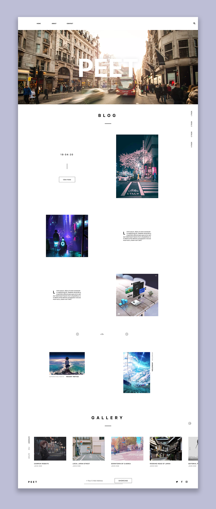

### complete work screen

# b-blog Layout

ver.1 - Simple

### Using CSS Flex
- basic Flex
- Flex Wrap

### Using CSS Grid
- basic Grid
- Grid template column
- Grid row
- Grid area
- Justify, Align, Place Self

### CSS4
- CSS Variables
- system-ui

### Common
- Install Parcel
- node_modules
- Configuring PostCSS
- Testing